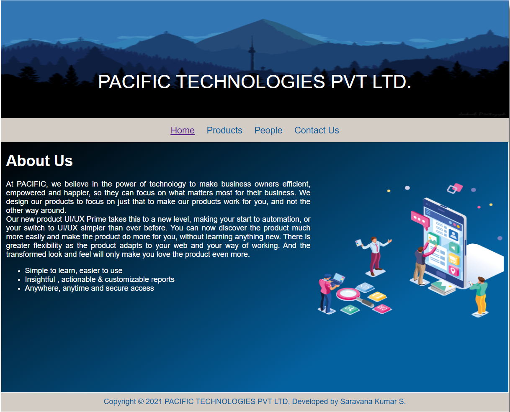
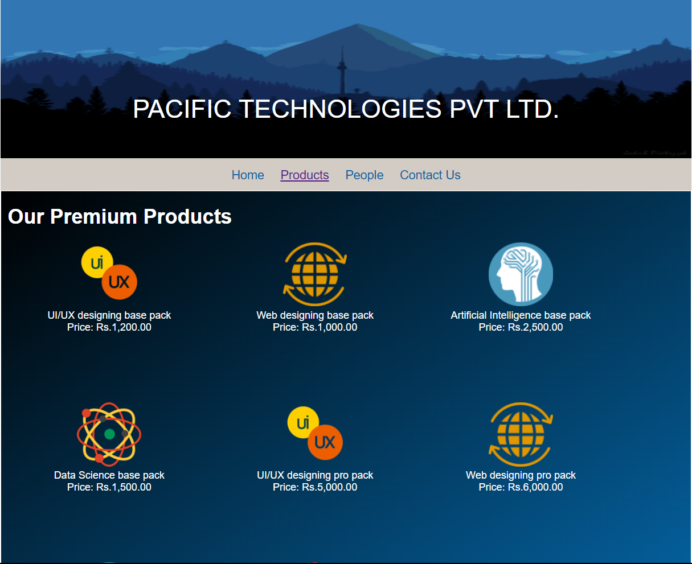
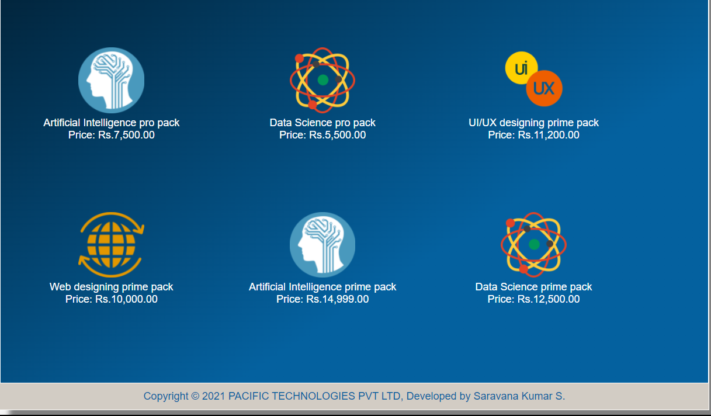

# Web Design for a Software Product Company

## AIM:

To design a static website for a software product company company.

## DESIGN STEPS:

### Step 1:

Requirement collection.

### Step 2:

Creating the layout using HTML and CSS.

### Step 3:

Updating the sample content.

### Step 4:

Choose the appropriate style and color scheme.

### Step 5:

Validate the layout in various browsers.

### Step 6:

Validate the HTML code.

### Step 6:

Publish the website in the given URL.

## PROGRAM :
### Home Page:
```
<!DOCTYPE html>
<html lang="en">
  <head>
    <title>PACIFIC TECHNOLOGIES PVT LTD</title>
    <link rel="stylesheet" href="./css/layout.css" />
    <link rel="icon" href="./img/pacific.png" type="image/x-icon" />
  </head>

  <body>
    <div class="container">
      <div class="banner">PACIFIC TECHNOLOGIES PVT LTD.</div>
      <div class="menu">
        <div class="menuitemselected"><a href="/static/home.html">Home</a></div>
        <div class="menuitem"><a href="/static/products.html">Products</a></div>
        <div class="menuitem"><a href="/static/people.html">People</a></div>
        <div class="menuitem"><a href="/static/contact.html">Contact Us</a></div>
      </div>
      <div class="content">
        <div class="homecontent">
          <h1>About Us</h1>
          
          <div class="contenttext">
            At PACIFIC, we believe in the power of technology to make business
            owners efficient, empowered and happier, so they can focus on what
            matters most for their business. We design our products to focus on
            just that to make our products work for you, and not the other way
            around.
            <br />
            Our new product UI/UX Prime takes this to a new level, making your
            start to automation, or your switch to UI/UX simpler than ever
            before. You can now discover the product much more easily and make
            the product do more for you, without learning anything new. There is
            greater flexibility as the product adapts to your web and your
            way of working. And the transformed look and feel will only make you
            love the product even more.
            <ul>
              <li>Simple to learn, easier to use</li>
              <li>Insightful , actionable & customizable reports</li>
              <li>Anywhere, anytime and secure access</li>
            </ul>
          </div>
        </div>
      </div>
      <div class="footer">
        Copyright &#169; 2021 PACIFIC TECHNOLOGIES PVT LTD, Developed by Saravana Kumar S.
      </div>
    </div>
  </body>
</html>
```
### Product Page:
```
<!DOCTYPE html>
<html lang="en">
  <head>
    <title>PACIFIC TECHNOLOGIES PVT LTD</title>
    <link rel="stylesheet" href="./css/layout.css" />
    <link rel="icon" href="./img/pacific.png" type="image/x-icon" />
  </head>

  <body>
    <div class="container">
      <div class="banner">PACIFIC TECHNOLOGIES PVT LTD.</div>
      <div class="menu">
        <div class="menuitem"><a href="/static/home.html">Home</a></div>
        <div class="menuitemselected"><a href="/static/products.html">Products</a></div>
        <div class="menuitem"><a href="/static/people.html">People</a></div>
        <div class="menuitem"><a href="/static/contact.html">Contact Us</a></div>
      </div>
      <div class="content">
        <div class="productcontent">    
          <h1>Our Premium Products</h1>
          <div class="productitems">
            <div class="productitem"> 
                  <div class="itemimage">
                  
                  </div>
                  <div class="itemname">UI/UX designing base pack</div>
                  <div class="itemprice">Price: Rs.1,200.00 </div>
              </div>
              <div class="productitem"> 
                <div class="itemimage">
                
                </div>
                <div class="itemname">Web designing base pack</div>
                <div class="itemprice">Price: Rs.1,000.00 </div>
            </div>
              <div class="productitem"> 
                  <div class="itemimage">
                  
                  </div>
                  <div class="itemname">Artificial Intelligence base pack</div>
                  <div class="itemprice">Price: Rs.2,500.00 </div>
              </div>
              <div class="productitem"> 
                  <div class="itemimage">
                  
                  </div>
                  <div class="itemname">Data Science base pack</div>
                  <div class="itemprice">Price: Rs.1,500.00 </div>
              </div>
              <div class="productitem"> 
                <div class="itemimage">
                
                </div>
                <div class="itemname">UI/UX designing pro pack</div>
                <div class="itemprice">Price: Rs.5,000.00 </div>
            </div>
            <div class="productitem"> 
              <div class="itemimage">
              
              </div>
              <div class="itemname">Web designing pro pack</div>
              <div class="itemprice">Price: Rs.6,000.00 </div>
          </div>
            <div class="productitem"> 
                <div class="itemimage">
                
                </div>
                <div class="itemname">Artificial Intelligence pro pack</div>
                <div class="itemprice">Price: Rs.7,500.00 </div>
            </div>
            <div class="productitem"> 
                <div class="itemimage">
                
                </div>
                <div class="itemname">Data Science pro pack</div>
                <div class="itemprice">Price: Rs.5,500.00 </div>
            </div>
            <div class="productitem"> 
              <div class="itemimage">
              
              </div>
              <div class="itemname">UI/UX designing prime pack</div>
              <div class="itemprice">Price: Rs.11,200.00 </div>
          </div>
          <div class="productitem"> 
            <div class="itemimage">
            
            </div>
            <div class="itemname">Web designing prime pack</div>
            <div class="itemprice">Price: Rs.10,000.00 </div>
        </div>
          <div class="productitem"> 
              <div class="itemimage">
              
              </div>
              <div class="itemname">Artificial Intelligence prime pack</div>
              <div class="itemprice">Price: Rs.14,999.00 </div>
          </div>
          <div class="productitem"> 
              <div class="itemimage">
              
              </div>
              <div class="itemname">Data Science prime pack</div>
              <div class="itemprice">Price: Rs.12,500.00 </div>
          </div>
          </div>
          </div>        
      </div>
      <div class="footer">
        Copyright &#169; 2021 PACIFIC TECHNOLOGIES PVT LTD, Developed by Saravana Kumar S.
      </div>
    </div>
  </body>
</html>
```
### People Page:
```
<!DOCTYPE html>
<html lang="en">
  <head>
    <title>PACIFIC TECHNOLOGIES PVT LTD</title>
    <link rel="stylesheet" href="./css/layout.css" />
    <link rel="icon" href="./img/pacific.png" type="image/x-icon" />
  </head>

  <body>
    <div class="container">
      <div class="banner">PACIFIC TECHNOLOGIES PVT LTD.</div>
      <div class="menu">
        <div class="menuitem"><a href="/static/home.html">Home</a></div>
        <div class="menuitem"><a href="/static/products.html">Products</a></div>
        <div class="menuitemselected"><a href="/static/people.html">People</a></div>
        <div class="menuitem"><a href="/static/contact.html">Contact Us</a></div>
      </div>
      <div class="content">
        <div class="productcontent">    
          <h1>Our Team Members</h1>
          <div class="productitems">
            <div class="productitem"> 
                  <div class="itemimage">
                  
                  </div>
                  <div class="itemname">Austin Wade</div>
                  <div class="itemprice"> Creative Head </div>
              </div>
              <div class="productitem"> 
                <div class="itemimage">
                
                </div>
                <div class="itemname">Olena Johnson</div>
                <div class="itemprice"> Design Director</div>
            </div>
              <div class="productitem"> 
                  <div class="itemimage">
                  
                  </div>
                  <div class="itemname">Laura Martin</div>
                  <div class="itemprice">Research Director </div>
              </div>
              <div class="productitem"> 
                  <div class="itemimage">
                  
                  </div>
                  <div class="itemname">Ian Wellmaker</div>
                  <div class="itemprice">Training Department Head </div>
              </div>
              <div class="productitem"> 
                <div class="itemimage">
                
                </div>
                <div class="itemname">Timothee Mark</div>
                <div class="itemprice">Chief in Product Management</div>
            </div>
            <div class="productitem"> 
              <div class="itemimage">
              
              </div>
              <div class="itemname">Victoria Silva</div>
              <div class="itemprice">Web Organiser</div>
          </div>
          </div>
          </div>        
      </div>
      <div class="footer">
        Copyright &#169; 2021 PACIFIC TECHNOLOGIES PVT LTD, Developed by Saravana Kumar S.
      </div>
    </div>
  </body>
</html>
```
### Contacts Page:
```
<!DOCTYPE html>
<html lang="en">
  <head>
    <title>PACIFIC TECHNOLOGIES PVT LTD</title>
    <link rel="stylesheet" href="./css/layout.css" />
    <link rel="icon" href="./img/pacific.png" type="image/x-icon" />
  </head>

  <body>
    <div class="container">
      <div class="banner">PACIFIC TECHNOLOGIES PVT LTD.</div>
      <div class="menu">
        <div class="menuitem"><a href="/static/home.html">Home</a></div>
        <div class="menuitem"><a href="/static/products.html">Products</a></div>
        <div class="menuitem"><a href="/static/people.html">People</a></div>
        <div class="menuitemselected"><a href="/static/contact.html">Contact Us</a></div>
      </div>
      <div class="content">
        <div class="homecontent">
          <h1>For Further Details:</h1>
          
          <div class="contenttext">
            Our Contact Address: NO:11,PACIFIC TECH PVT LTD., Baker street, London, England.
            <br>
            Contact NO: 9940728345
            <br>
            Landline: 911 8375 6789
            <br>
            Our Email: pacific_pvt_ltd@yahoo.com 
         </div>
        </div>
      </div>
      <div class="footer">
        Copyright &#169; 2021 PACIFIC TECHNOLOGIES PVT LTD, Developed by Saravana Kumar S.
      </div>
    </div>
  </body>
</html>
```
## OUTPUT:

### Home Page:


### Products Page:



### Peoples Page:


### Contacts Page:

## Result:

Thus a website is designed for the software product company and the HTML,CSS code are validated.
